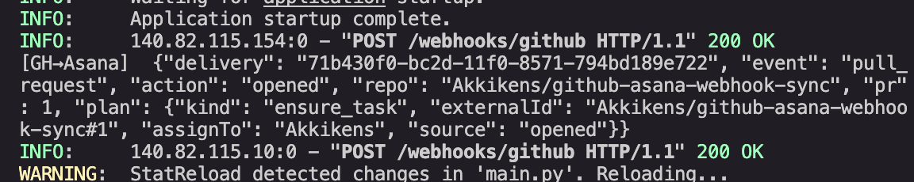

# GitHub && Asana Webhook Sync (Prototype)

This is a lightweight FastAPI server that listens for **GitHub Pull Request events** and logs what Asana actions would be taken — things like assigning tasks, marking them complete, or reopening them.

It's basically a clean, minimal scaffold designed to replace the slower GitHub-Actions-based sync with something that reacts instantly via webhooks.

## Getting Started

### 1. Clone and set up

```bash
git clone https://github.com/Akkikens/github-asana-webhook-sync.git
cd github-asana-webhook-sync
python3 -m venv .venv
source .venv/bin/activate
pip install fastapi uvicorn python-dotenv
```

### 2. Create your `.env` file

```bash
GITHUB_WEBHOOK_SECRET=<your_random_secret_here>
```

You can generate a secret with:
```bash
openssl rand -hex 32
```

### 3. Run the server

```bash
uvicorn main:app --reload --port 8000
```

### 4. Expose it to GitHub

Use ngrok (or cloudflared) to make your local server accessible:

```bash
ngrok http 8000
```

Copy the `https://...ngrok-free.app` URL it gives you.

## Add the Webhook in GitHub

Head over to your repository → **Settings** → **Webhooks** → **Add Webhook**

| Field | Value |
|-------|-------|
| Payload URL | `https://<your-ngrok-url>/webhooks/github` |
| Content type | `application/json` |
| Secret | Same as your `.env` |
| SSL verification | Enabled |
| Events | Let me select → ✅ Pull requests |
| Active | ✅ |

Save it — GitHub will immediately send a ping event (you should see `200 OK` in your terminal).

## Example Output

When you open a PR, you'll see something like this in your terminal:

```bash
[GH→Asana] {
  "delivery": "71b430f0-bc2d-11f0-8571-794bd189e722",
  "event": "pull_request",
  "action": "opened",
  "repo": "Akkikens/github-asana-webhook-sync",
  "plan": {
    "kind": "ensure_task",
    "externalId": "Akkikens/github-asana-webhook-sync#1",
    "assignTo": "Akkikens",
    "source": "opened"
  }
}
```

## How it works right now

- **Default assignee:** Falls back to the PR author if nobody's assigned
- **Closed PR (merged or not):** Would mark the task as complete
- **Unassigned PR:** Would reassign the task back to the author
- **Everything else:** Gets logged but not executed

At this stage, the app just logs what it *would* do — no actual Asana API calls yet. That's coming next.

## What's next

- Wire up the Asana API (create, update, and complete tasks)
- Build a proper mapping system between PRs and Asana task IDs
- Add error logging and retry logic
- Deploy this thing to a lightweight cloud instance or container

## Working Screenshots
